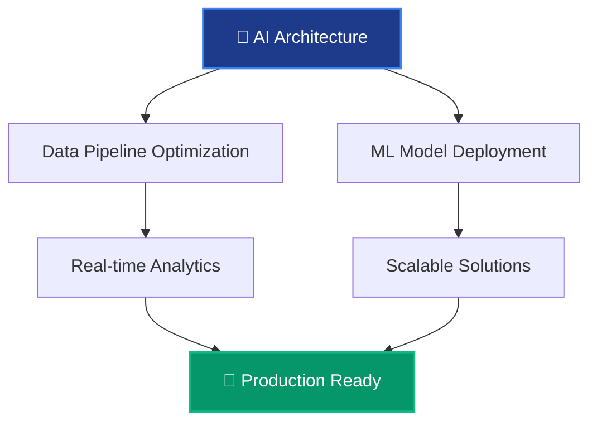

<div align="center">
  
# 🚀 Welcome to Moji's Data & AI Universe! 
### *Where Data Meets Intelligence* 🧠✨


</div>

---

<div align="center">
  
## 🎯 About Me

```python
class DataArchitect:
    def __init__(self):
        self.name = "Moji"
        self.role = "Data & AI Architect"
        self.location = "Milan, Italy 🇮🇹"
        self.status = "Freelance Professional"
        self.specialization = "Data & AI Engineering"
        self.motto = "Turning Data into Intelligence"
        
    def get_current_focus(self):
        return [
            "Building scalable data pipelines",
            "Designing AI architectures",
            "Optimizing ML workflows",
            "Chess strategy optimization 🏁"
        ]
```

</div>

---

## 🛠️ Tech Arsenal

<div align="center">

### 💻 Programming Languages


### ☁️ Cloud Platforms


### 🗄️ Databases & Data Tech


</div>

---

## 📊 GitHub Analytics

<div align="center">
  


</div>

<div align="center">
  
[](https://git.io/streak-stats)

</div>

---

## 🎯 What I'm Working On

<div align="center">



</div>

---

## 🏆 Achievement Unlocked

<div align="center">

| 🎾 Tennis Enthusiast | ♟️ Chess Strategist | 🔧 Pipeline Optimizer | 🌍 Multi-Cloud Expert |
|:---:|:---:|:---:|:---:|
| *Serving aces on and off the court* | *Always thinking 5 moves ahead* | *Making data flow like poetry* | *Architecting across all clouds* |

</div>

---

## 🎮 Fun Zone

<div align="center">

### 🎲 Random Dev Joke


### 🏃‍♂️ Current Status
```
🔥 Building the future of data architecture
🎾 Perfecting my backhand
♟️ Analyzing chess positions
☕ Fueled by espresso (it's Milan, after all!)
```

</div>

---

## 📈 Contribution Graph

<div align="center">


</div>

---

## 🤝 Let's Connect!

<div align="center">

### 💬 *"Always up for a challenge—whether it's optimizing data pipelines or finding a killer move in chess!"*

[](https://visitcount.itsvg.in)

---


</div>

---

<div align="center">
  <sub>🚀 Built with passion in Milan | 🎯 Crafted for the GitHub community</sub>
</div>

<!--
## Hi there 👋
**mojiTMJ/mojiTMJ** is a ✨ _special_ ✨ repository because its `README.md` (this file) appears on your GitHub profile.

Here are some ideas to get you started:

- 🔭 I’m currently working on ...
- 🌱 I’m currently learning ...
- 👯 I’m looking to collaborate on ...
- 🤔 I’m looking for help with ...
- 💬 Ask me about ...
- 📫 How to reach me: ...
- 😄 Pronouns: ...
- ⚡ Fun fact: ...
-->
